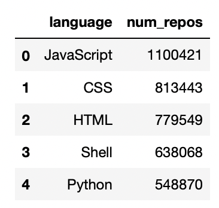
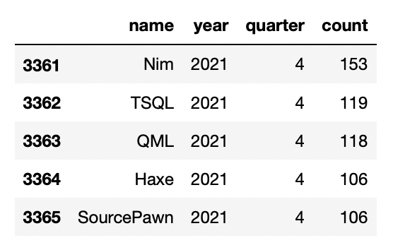
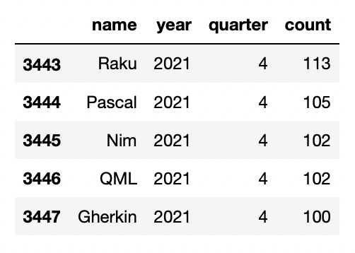
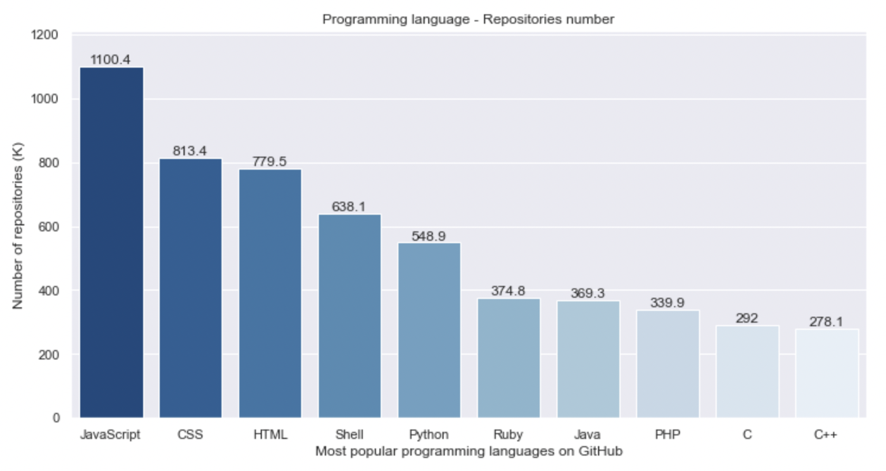
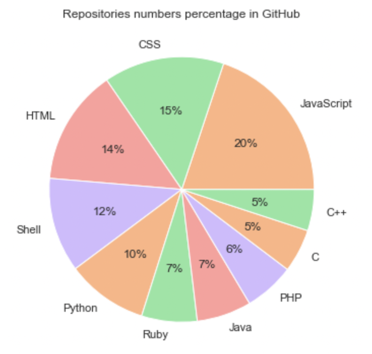
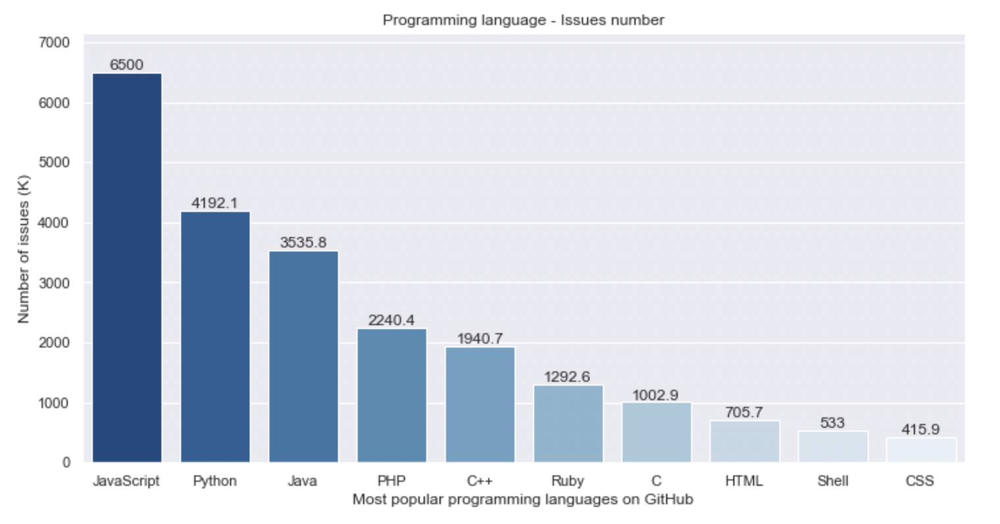
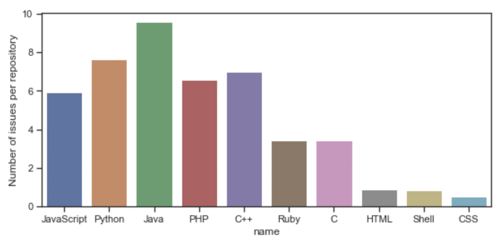
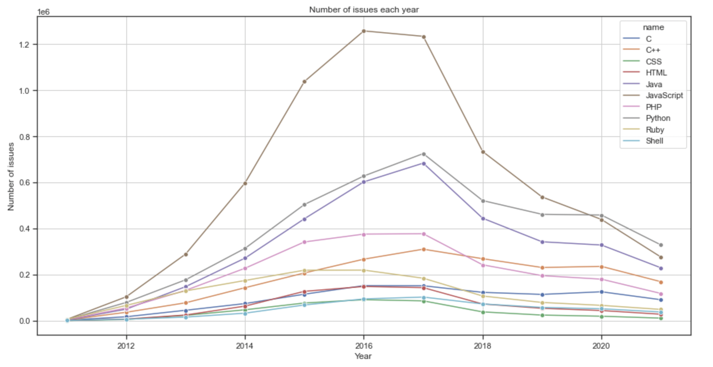
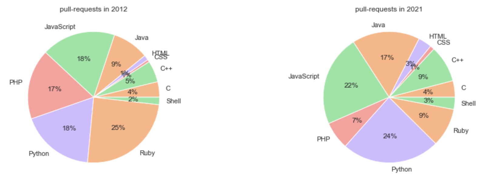
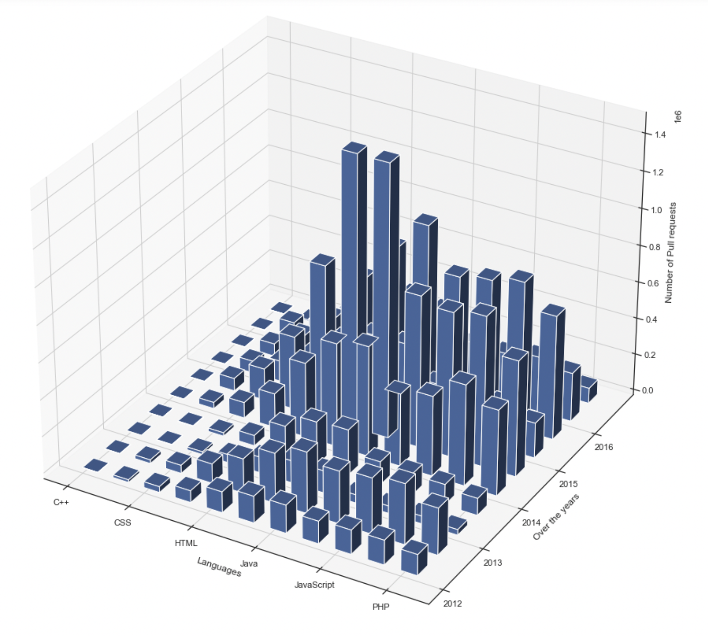

  
  
# Data Science Portfolio
### Hi there! I'm Yulduz! I tried to share my most different Data Science projects.
#### In this page you will see the explanation and some conclusions and results.
#### At the end of each project there's a link to source code
  
  
<!-- Table of Contents -->
# :notebook_with_decorative_cover: Table of Contents

- [Project 1](#star2-about-the-project-1)
  * [Data 1](#camera-data-1)
  * [ML](#dart-ml)
  * [Source Code](#scroll-source-code)
- [Project 2](#star2-about-the-project-2)
  * [Data 2](#camera-data-2)
  * [Exploratory Data Analysis](#dart-exploratory-data-analysis)
  * [Source Code 2](#scroll-source-code-2)
- [Project 3](#star3-about-the-project-3)
  * [Data 1](#camera-data-3)
  * [ML](#dart-ml)
  * [Source Code](#scroll-source-code)
- [Contributing](#wave-contributing)
  * [Code of Conduct](#scroll-code-of-conduct)
- [Contact](#handshake-contact)

  

<!-- About the Project 1-->
## :star2: About the Project 1
### School students final grade prediction
#### This data approach student achievement in secondary education of two Portuguese schools. The data attributes include student grades, demographic, social and school related features) and it was collected by using school reports and questionnaires. Two datasets are provided regarding the performance in two distinct subjects: Mathematics (mat) and Portuguese language (por). 
#### The main purpose is to predict sutends' final grade based on their family backgound, school, their previous grades and other attributes. The technique used in this project is CatBoost Regressor, which managed to show quite good results.
#### Here's the initial data:
  <!-- Data 1 -->
### :camera: Data 1

  
  

  
 #### The initial thought was that the final grade may depend on the address attribute (urban/rural areas) and also may depend on the sex of a student. But apparently, they was not the most important attributes for the final grade: both of them have similar distributions:
  
  

  
    

  
 #### Obviously, the final grade strongly depends on the previous failures of a student. The higher the number of failures, the less the final grade:
    
 

   

 

  
### ML
  <!-- ML -->
### :dart: ML
#### The model used in prediction is CatBoost regressor, which is quite good at handling categorical features. The model showes quite good results:
  
 

   
   

  
#### Also real and predicted target values:
  

   
 
  

  
<!-- Source Code -->
### :scroll: Source Code
  
  https://github.com/yulduzerkiniy/Portfolio/tree/main/students_grade
  
  
  

<!-- About the Project 2-->
## :star2: About the Project 2
#### A common question for those new and familiar to computer science and software engineering is what is the most best and/or most popular programming language. It is very difficult to give a definitive answer, as there are a seemingly indefinite number of metrics that can define the 'best' or 'most popular' programming language. One such metric that can be used to define a 'popular' programming language is the number of projects and files that are made using that programming language. As GitHub is the most popular public collaboration and file-sharing platform, analyzing the languages that are used for repositories, PRs, and issues on GitHub and be a good indicator for the popularity of a language.

  <!-- Data 2 -->
### :camera: Data 2
  
#### This dataset contains statistics about the programming languages used for repositories, PRs, and issues on GitHub. The data is from 2011 to 2021. This data was queried and aggregated from BigQuery's public github_repos and githubarchive datasets. Only data for public GitHub repositories, and their corresponding PRs/issues, have their data available publicly. Thus, this dataset is only based on public repositories, which may not be fully representative of all repositories on GitHub.

  
  

  
  
### Exploratory Data Analysis
  <!-- Exploratory Data Analysis -->
### :dart: Exploratory Data Analysis
#### Obviously over the dacade JavaScript is definitely the most 'popular' language among others:
  
 

   
   

  
#### The same idea gives this pie chart:
  

   
   

  
#### Quite intuitive to think that big number of repositories leads to more issues:
  

   
   

  
#### To confirm the thought:
  

   
   

  
#### However! Can we simply make a such a conclusion? According to the trends for each year Javascript lost its popularities starting in 2017. And after several years it completely missed its position losing to Python:
  

   
   

  
#### Let's try to demostrante it by means of pull requests percentage in 2012 and 2021:
  

   
   

  
#### Some fency 3D distribution graph for some popular languages for each year:
  

   
 
  

  
<!-- Source Code 2 -->
### :scroll: Source Code 2
  
  https://github.com/yulduzerkiniy/Portfolio/tree/main/programming_languages_Data_Visualization
  
  

<!-- About the Project 3-->
## :star2: About the Project 3
### eCommerce store events data analysis
#### This file contains behavior data for Nov 2019 from a large electronics commerce online store.
Each row in the file represents an event. All events are related to products and users. Each event is like many-to-many relation between products and users.
Data collected by Open CDP project.
#### The main purpose is to group customers into several categories. Several approaches have been used, like RFM which is widely used in marketing and k-means machine learning approach.
#### Here's the initial data:
  <!-- Data 3 -->
### :camera: Data 3

  
  

  
 #### Quite obvious that users usually view a lot before adding something to cart. After that they can actually purchase desired items:
  
  

  
    

  
 ### RFM
 #### RFM is a method used for analyzing customer value. It is commonly used in database marketing and direct marketing and has received particular attention in retail and professional services industries.

 #### RFM stands for the three dimensions:
    Recency – How recently did the customer purchase?
    Frequency – How often do they purchase?
    Monetary Value – How much do they spend?

#### source: https://en.wikipedia.org/wiki/RFM_(market_research)

#### In this method I'm trying to divide customers to categories, highlight the loyal and regular customers; identify customers who were loyal before in order to 'remind' about some new sales/services
  
###  Segmentation using k-means

#### Using some manimulations like MinMaxScaler, PCA to help clusterization algorith, and kMeans to clusterize, we got simple customers classification to "Loyal customers" and not so much.
  
#### Quite obvious that we can split customers to groups. In this case I decided to divide them into 2 groups. Group1 are people whose last purchase was quite a lot time ago, spent less money and not many purchases. Whilst, for Gruop0 is quite opposite. Last purchase mean is 9 days ago, spent in average $700, mean number of purchase is 2. Also, quantiles looks better
  
### RFM Segmentation
  #### https://www.optimove.com/resources/learning-center/rfm-segmentation
  
  #### The first step in building an RFM model is to assign Recency, Frequency and Monetary values to each customer.
  #### The second step is to divide the customer list into tiered groups for each of the three dimensions (R, F and M). Unless using specialized software, it’s recommended to divide the customers into four tiers for each dimension, such that each customer will be assigned to one tier in each dimension. This results in 64 distinct customer segments (4x4x4), into which customers will be segmented.
  #### The simplest way to create customers segments from RFM Model is to use Quartiles. We assign a score from 1 to 4 to Recency, Frequency and Monetary. Four is the best/highest value, and one is the lowest/worst value. A final RFM score is calculated simply by combining individual RFM score numbers.
  
  

   
 
  

  
 

  #### The third step is to select groups of customers to whom specific types of communications will be sent, based on the RFM segments in which they appear.
   
   
#### It is helpful to assign names to segments of interest:
   **Best Customers** – This group consists of those customers who are found in R-Tier-1, F-Tier-1 and M-Tier-1, meaning that they transacted recently, do so often and spend more than other customers. A shortened notation for this segment is 1-1-1; we’ll use this notation going forward.
   
   **High-spending New Customers** – This group consists of those customers in 1-4-1 and 1-4-2. These are customers who transacted only once, but very recently and they spent a lot.
   
   **Lowest-Spending Active Loyal Customers** – This group consists of those customers in segments 1-1-3 and 1-1-4 (they transacted recently and do so often, but spend the least).
   
   **Churned Best Customers** – This segment consists of those customers in groups 4-1-1, 4-1-2, 4-2-1 and 4-2-2 (they transacted frequently and spent a lot, but it’s been a long time since they’ve transacted).
  
 

   

 

  
### Wider RFM segmentation
  <!-- ML -->
### :dart: ML
#### Now that we've identified our customer categories, we can decide how to approach or deal with each customer.
  
#### Link to the article:
https://documentation.bloomreach.com/engagement/docs/rfm-segmentation
  
 

   
   

  
#### Also real and predicted target values:
  

   
 
  

  
<!-- Source Code -->
### :scroll: Source Code
  
  https://github.com/yulduzerkiniy/Portfolio/tree/main/students_grade
  
  
  
  
  
  
  

<!-- Contributing -->
## :wave: Contributing

 
Contributions are always welcome!

See `contributing.md` for ways to get started.

<!-- Contact -->
## :handshake: Contact

Your Name - [@linkedin](linkedin.com/in/yulduz-erkiniy-228354248) - yerkiniy@gmail.com

Project Link: https://github.com/yulduzerkiniy/Portfolio

