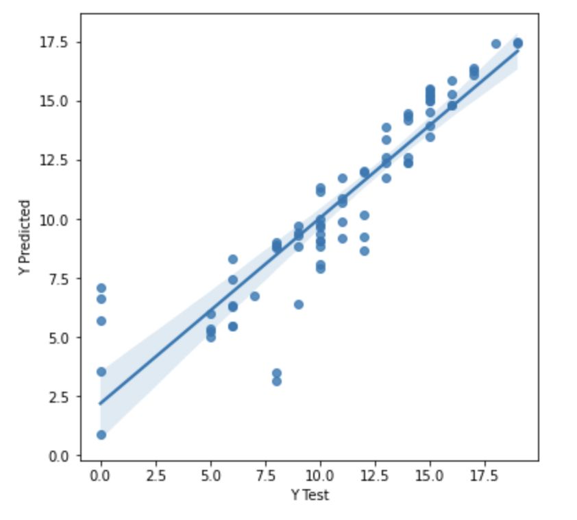

  
  
# Data Science Portfolio
### Hi there! I'm Yulduz! I tried to share my most different Data Science projects.
#### In this page you will see the explanation and some conclusions and results.
#### At the end of each project there's a link to source code
  
  
<!-- Table of Contents -->
# :notebook_with_decorative_cover: Table of Contents

- [Project 1](#star2-about-the-project)
  * [Data](#camera-data)
  * [ML](#dart-ml)
  * [Source Code](#scroll-source-code)
- [Project 2](#toolbox-getting-started)
  * [Prerequisites](#bangbang-prerequisites)
  * [Installation](#gear-installation)
  * [Running Tests](#test_tube-running-tests)
  * [Run Locally](#running-run-locally)
  * [Deployment](#triangular_flag_on_post-deployment)
- [Project 3](#toolbox-getting-started)
  * [Prerequisites](#bangbang-prerequisites)
  * [Installation](#gear-installation)
  * [Running Tests](#test_tube-running-tests)
  * [Run Locally](#running-run-locally)
  * [Deployment](#triangular_flag_on_post-deployment)
- [Usage](#eyes-usage)
- [Roadmap](#compass-roadmap)
- [Contributing](#wave-contributing)
  * [Code of Conduct](#scroll-code-of-conduct)
- [FAQ](#grey_question-faq)
- [License](#warning-license)
- [Contact](#handshake-contact)
- [Acknowledgements](#gem-acknowledgements)

  

<!-- About the Project 1-->
## :star2: About the Project
### School students final grade prediction
#### This data approach student achievement in secondary education of two Portuguese schools. The data attributes include student grades, demographic, social and school related features) and it was collected by using school reports and questionnaires. Two datasets are provided regarding the performance in two distinct subjects: Mathematics (mat) and Portuguese language (por). 
#### The main purpose is to predict sutends' final grade based on their family backgound, school, their previous grades and other attributes. The technique used in this project is CatBoost Regressor, which managed to show quite good results.
#### Here's the initial data:
  <!-- Data -->
### :camera: Data

  
  

  
 #### The initial thought was that the final grade may depend on the address attribute (urban/rural areas) and also may depend on the sex of a student. But apparently, they was not the most important attributes for the final grade: both of them have similar distributions:
  
  

  
    

  
 #### Obviously, the final grade strongly depends on the previous failures of a student. The higher the number of failures, the less the final grade:
    
 

   

 

  
### ML
  <!-- ML -->
### :dart: ML
#### The model used in prediction is CatBoost regressor, which is quite good at handling categorical features. The model showes quite good results:
  
 

   
   

  
#### Also real and predicted target values:
  

   
 
  

  
<!-- Source Code -->
### :scroll: Source Code
  
  
  
  

<!-- Contributing -->
## :wave: Contributing

Contributions are always welcome!

See `contributing.md` for ways to get started.

<!-- Contact -->
## :handshake: Contact

Your Name - [@twitter_handle](https://twitter.com/twitter_handle) - email@email_client.com

Project Link: [https://github.com/Louis3797/awesome-readme-template](https://github.com/Louis3797/awesome-readme-template)

