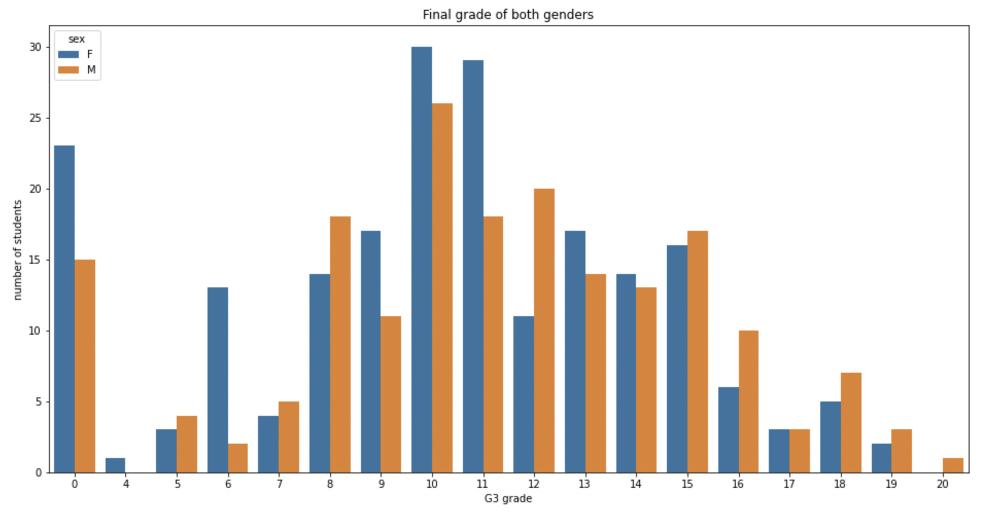

<div align="left">
  
  
# Data Science Portfolio
### Hi there! I'm Yulduz! I tried to share my most different Data Science projects.
#### In this page you will see the explanation and some conclusions and results.
#### At the end of each project there's a link to siyrce code

## Project 1. School students final grade prediction
#### This data approach student achievement in secondary education of two Portuguese schools. The data attributes include student grades, demographic, social and school related features) and it was collected by using school reports and questionnaires. Two datasets are provided regarding the performance in two distinct subjects: Mathematics (mat) and Portuguese language (por). 
#### The main purpose is to predict sutends' final grade based on their family backgound, school, their previous grades and other attributes. The technique used in this project is CatBoost Regressor, which managed to show quite good results.
#### Here's the initial data:

<div align="center">

  
  
<div align="left">
  
 #### The initial thought was that the final grade may depend on the address attribute (urban/rural areas) and also may depend on the sex of a student. But apparently, they was not the most important attributes for the final grade: both of them have similar distributions:
  
  <div align="center">

  
    
<div align="left">
  
 #### Obviously, the final grade strongly depends on the previous failures of a student. The higher the number of failures, the less the final grade:
    
 <div align="center">

   

 
<div align="left">
  
### ML
#### The model used in prediction is CatBoost regressor, which is quite good at handling categorical features. The model showes quite good results:
  
 <div align="center">

   
   
<div align="left">
  
#### Also real and predicted target values:
  
<div align="center">

   
   
   
<!-- Badges -->
<p>
  <a href="https://github.com/Louis3797/awesome-readme-template/graphs/contributors">
    
  </a>
  <a href="">
    
  </a>
  <a href="https://github.com/Louis3797/awesome-readme-template/network/members">
    
  </a>
  <a href="https://github.com/Louis3797/awesome-readme-template/stargazers">
    
  </a>
  <a href="https://github.com/Louis3797/awesome-readme-template/issues/">
    
  </a>
  <a href="https://github.com/Louis3797/awesome-readme-template/blob/master/LICENSE">
    
  </a>
</p>
   
<h4>
    <a href="https://github.com/Louis3797/awesome-readme-template/">View Demo</a>
  <span> · </span>
    <a href="https://github.com/Louis3797/awesome-readme-template">Documentation</a>
  <span> · </span>
    <a href="https://github.com/Louis3797/awesome-readme-template/issues/">Report Bug</a>
  <span> · </span>
    <a href="https://github.com/Louis3797/awesome-readme-template/issues/">Request Feature</a>
  </h4>
</div>

<br />

<!-- Table of Contents -->
# :notebook_with_decorative_cover: Table of Contents

- [About the Project](#star2-about-the-project)
  * [Screenshots](#camera-screenshots)
  * [Tech Stack](#space_invader-tech-stack)
  * [Features](#dart-features)
  * [Color Reference](#art-color-reference)
  * [Environment Variables](#key-environment-variables)
- [Getting Started](#toolbox-getting-started)
  * [Prerequisites](#bangbang-prerequisites)
  * [Installation](#gear-installation)
  * [Running Tests](#test_tube-running-tests)
  * [Run Locally](#running-run-locally)
  * [Deployment](#triangular_flag_on_post-deployment)
- [Usage](#eyes-usage)
- [Roadmap](#compass-roadmap)
- [Contributing](#wave-contributing)
  * [Code of Conduct](#scroll-code-of-conduct)
- [FAQ](#grey_question-faq)
- [License](#warning-license)
- [Contact](#handshake-contact)
- [Acknowledgements](#gem-acknowledgements)

  

<!-- About the Project -->
## :star2: About the Project


<!-- Screenshots -->
### :camera: Screenshots

<div align="center"> 
  
</div>


<!-- TechStack -->
### :space_invader: Tech Stack

<details>
  <summary>Client</summary>
  <ul>
    <li><a href="https://www.typescriptlang.org/">Typescript</a></li>
    <li><a href="https://nextjs.org/">Next.js</a></li>
    <li><a href="https://reactjs.org/">React.js</a></li>
    <li><a href="https://tailwindcss.com/">TailwindCSS</a></li>
  </ul>
</details>

<details>
  <summary>Server</summary>
  <ul>
    <li><a href="https://www.typescriptlang.org/">Typescript</a></li>
    <li><a href="https://expressjs.com/">Express.js</a></li>
    <li><a href="https://go.dev/">Golang</a></li>
    <li><a href="https://nestjs.com/">Nest.js</a></li>
    <li><a href="https://socket.io/">SocketIO</a></li>
    <li><a href="https://www.prisma.io/">Prisma</a></li>    
    <li><a href="https://www.apollographql.com/">Apollo</a></li>
    <li><a href="https://graphql.org/">GraphQL</a></li>
  </ul>
</details>

<details>
<summary>Database</summary>
  <ul>
    <li><a href="https://www.mysql.com/">MySQL</a></li>
    <li><a href="https://www.postgresql.org/">PostgreSQL</a></li>
    <li><a href="https://redis.io/">Redis</a></li>
    <li><a href="https://neo4j.com/">Neo4j</a></li>
    <li><a href="https://www.mongodb.com/">MongoDB</a></li>
  </ul>
</details>

<details>
<summary>DevOps</summary>
  <ul>
    <li><a href="https://www.docker.com/">Docker</a></li>
    <li><a href="https://www.jenkins.io/">Jenkins</a></li>
    <li><a href="https://circleci.com/">CircleCLI</a></li>
  </ul>
</details>

<!-- Features -->
### :dart: Features

- Feature 1
- Feature 2
- Feature 3

<!-- Color Reference -->
### :art: Color Reference

| Color             | Hex                                                                |
| ----------------- | ------------------------------------------------------------------ |
| Primary Color |  #222831 |
| Secondary Color |  #393E46 |
| Accent Color |  #00ADB5 |
| Text Color |  #EEEEEE |


<!-- Env Variables -->
### :key: Environment Variables

To run this project, you will need to add the following environment variables to your .env file

`API_KEY`

`ANOTHER_API_KEY`

<!-- Getting Started -->
## 	:toolbox: Getting Started

<!-- Prerequisites -->
### :bangbang: Prerequisites

This project uses Yarn as package manager

```bash
 npm install --global yarn
```

<!-- Installation -->
### :gear: Installation

Install my-project with npm

```bash
  yarn install my-project
  cd my-project
```
   
<!-- Running Tests -->
### :test_tube: Running Tests

To run tests, run the following command

```bash
  yarn test test
```

<!-- Run Locally -->
### :running: Run Locally

Clone the project

```bash
  git clone https://github.com/Louis3797/awesome-readme-template.git
```

Go to the project directory

```bash
  cd my-project
```

Install dependencies

```bash
  yarn install
```

Start the server

```bash
  yarn start
```


<!-- Deployment -->
### :triangular_flag_on_post: Deployment

To deploy this project run

```bash
  yarn deploy
```


<!-- Usage -->
## :eyes: Usage

Use this space to tell a little more about your project and how it can be used. Show additional screenshots, code samples, demos or link to other resources.


```javascript
import Component from 'my-project'

function App() {
  return <Component />
}
```

<!-- Roadmap -->
## :compass: Roadmap

* [x] Todo 1
* [ ] Todo 2


<!-- Contributing -->
## :wave: Contributing

<a href="https://github.com/Louis3797/awesome-readme-template/graphs/contributors">
  
</a>


Contributions are always welcome!

See `contributing.md` for ways to get started.


<!-- Code of Conduct -->
### :scroll: Code of Conduct

Please read the [Code of Conduct](https://github.com/Louis3797/awesome-readme-template/blob/master/CODE_OF_CONDUCT.md)

<!-- FAQ -->
## :grey_question: FAQ

- Question 1

  + Answer 1

- Question 2

  + Answer 2


<!-- License -->
## :warning: License

Distributed under the no License. See LICENSE.txt for more information.


<!-- Contact -->
## :handshake: Contact

Your Name - [@twitter_handle](https://twitter.com/twitter_handle) - email@email_client.com

Project Link: [https://github.com/Louis3797/awesome-readme-template](https://github.com/Louis3797/awesome-readme-template)


<!-- Acknowledgments -->
## :gem: Acknowledgements

Use this section to mention useful resources and libraries that you have used in your projects.

 - [Shields.io](https://shields.io/)
 - [Awesome README](https://github.com/matiassingers/awesome-readme)
 - [Emoji Cheat Sheet](https://github.com/ikatyang/emoji-cheat-sheet/blob/master/README.md#travel--places)
 - [Readme Template](https://github.com/othneildrew/Best-README-Template)

